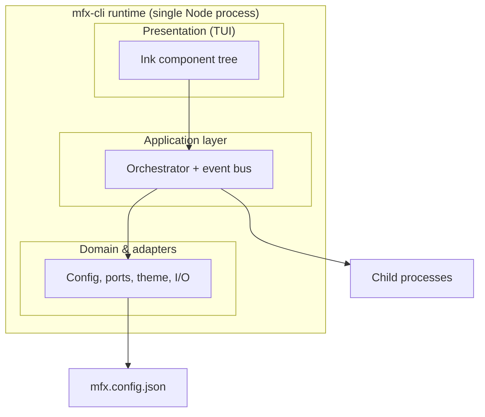
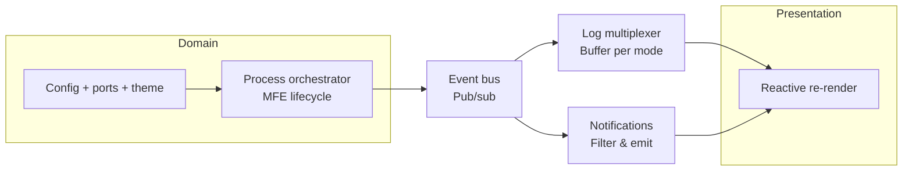
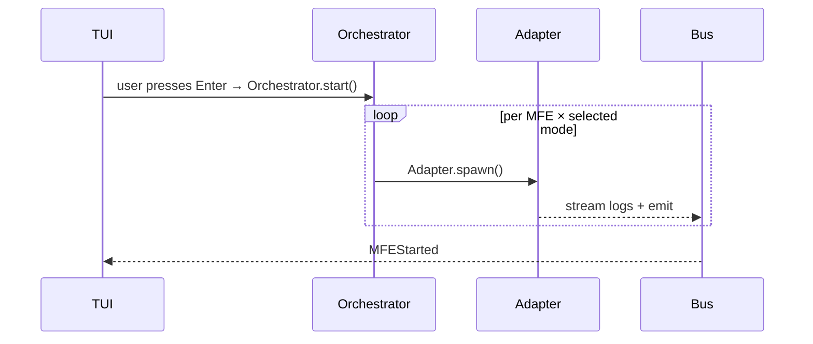
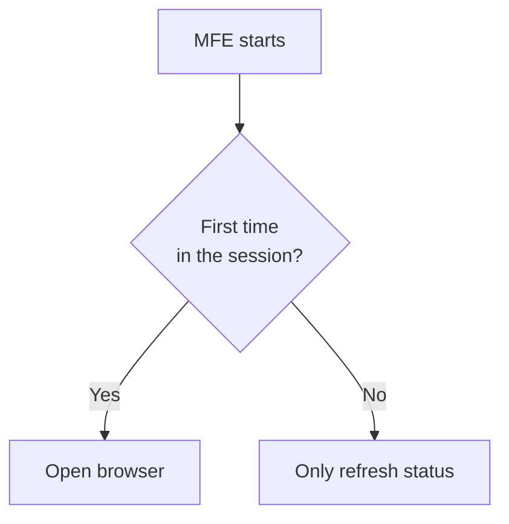
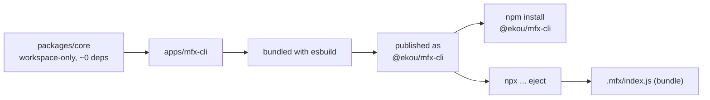

# mfx-cli — Architecture

Interactive CLI devtool for managing microfrontends under the EKOU brand. Built
with Ink for the terminal UI, process orchestration, port assignment, configurable
theming, and two installation modes: as a regular npm dependency or as source code
the user owns.

---

## Monorepo

```
ekou-devtools/
├── apps/
│   └── mfx-cli/          ← @ekou/mfx-cli binary
├── packages/
│   ├── core/             ← process manager, config parser, port assignment
│   ├── tui/              ← reusable Ink components
│   └── types/            ← shared TypeScript types
└── docs/
    ├── requirements.md   ← functional spec (FR-01 to FR-12)
    ├── architecture.md   ← this file
    ├── adr/              ← architecture decision records (MADR format)
    └── assets/
```

Turborepo orchestrates build/test across `apps/` and `packages/`. Only
`apps/mfx-cli` is published to npm — `packages/*` are workspace-internal
and never installed separately.

---

## Stack

| Area | Choice |
|---|---|
| CLI framework | Commander.js + Ink (React for the terminal) |
| Setup wizard | @clack/prompts |
| Tests | Vitest + ink-testing-library + execa |
| Architecture decisions | MADR format in `docs/adr/` |

---

## Architecture — layers



`packages/tui` only reads from the event bus — it never calls `core` directly.
This is what allows testing the orchestrator end-to-end with
`ink-testing-library` without spinning up any real TUI.

---

## The event bus as backbone



The domain layer (config/ports/theme) never talks directly to the TUI. This means
the notification panel (FR-10) can be toggled off without touching the orchestrator,
and the orchestrator can be tested without any TUI.

---

## MFE startup sequence



---

## Decision: browser reopening (FR-05)



> **Open question:** there is no "ready to accept connections?" check before
> opening the browser. Without it, the first open may hit a dev server that
> hasn't finished starting. Options: poll the port vs. parse the Vite/webpack
> log output. See §Open questions below.

---

## Distribution: npm vs eject



**Option 1 — regular npm dependency**

```bash
npm install @ekou/mfx-cli
```

**Option 2 — copy-paste (no dependency)**

```bash
npx @ekou/mfx-cli eject
```

`eject` copies `apps/mfx-cli/` + `packages/core/` already compiled (via esbuild)
into a `.mfx/` folder inside the user's project:

```
your-project/
└── .mfx/
    ├── index.js          ← compiled bundle, zero external deps
    └── mfx.config.json
```

And adds a script to `package.json`:

```json
{
  "scripts": {
    "mfx": "node .mfx/index.js"
  }
}
```

No `node_modules/@ekou`, no automatic updates, no npm dependency. The
`core` / `cli` separation is what makes it possible to bundle everything into
a single self-contained `index.js`.

---

## Key design decisions

- **Result type instead of exceptions** for expected errors (invalid config,
  port overlap) → errors are always explicit and actionable.
- **`packages/core` is zero-runtime-deps.** All `mfx.config.json` validation
  is hand-rolled; `zod` lives in an isolated schema-generation script
  (`config/schema-gen/`) that never runs on the hot path.
- **`Session`** (in `packages/core`) is the single source of truth for "what is
  running" and "what has already been opened in the browser" — resolves FR-05
  and FR-08 without the TUI or orchestrator keeping their own parallel state.
- **`assignPorts` is a pure, deterministic function** → testable with
  property-based testing (`fast-check`) instead of hand-enumerating cases.

---

## Open questions

Not out of scope — just not yet decided:

- [ ] "Ready to accept connections" detection before opening the browser (FR-05)
- [ ] Behavior when an MFE crashes on its own, without user action
- [ ] Ctrl+C propagation to all child processes (clean shutdown)
- [ ] Two `mfx` instances running against the same `mfx.config.json`
- [ ] Cross-platform port purge (Windows vs. Unix)
- [ ] Non-interactive / CI mode (`--json` flag, exit codes)
- [ ] Explicit trust boundary: arbitrary shell commands in `mfx.config.json`
- [ ] `mfx.config.json` schema versioning and migration

---

## See also

- [requirements.md](requirements.md) — full functional spec (FR-01 to FR-12)
- [adr/](adr/) — individual architecture decision records (MADR)
