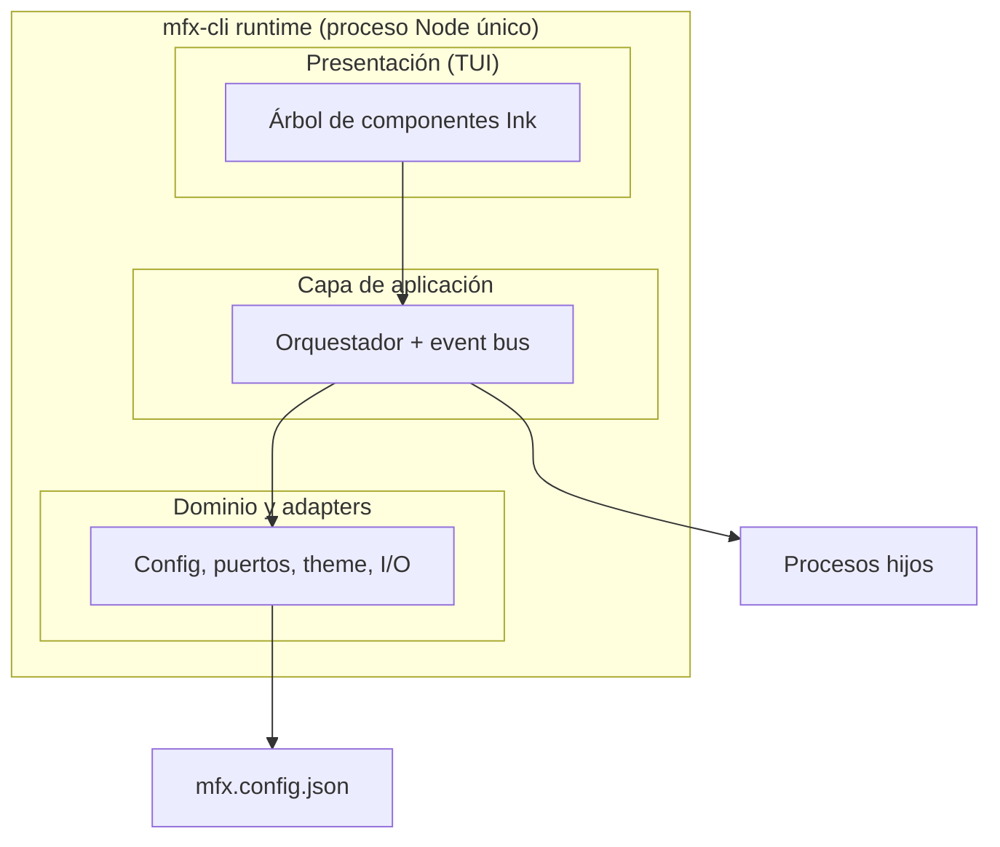
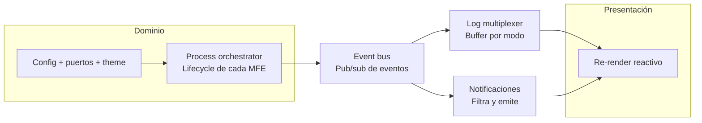
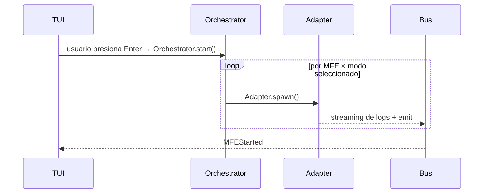
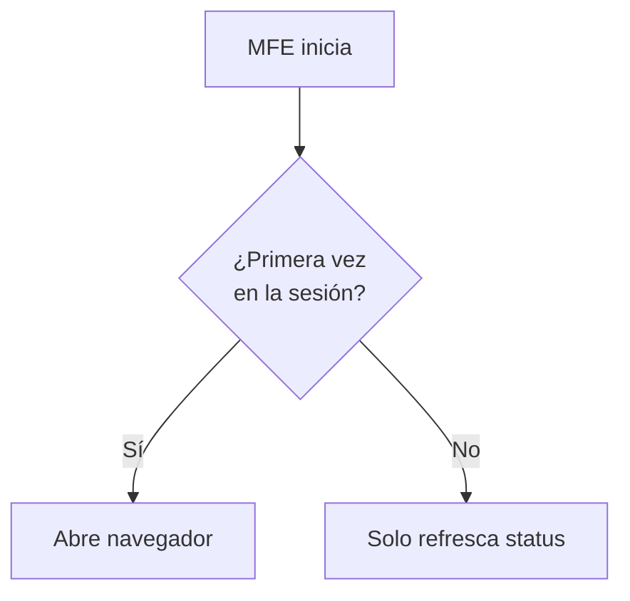
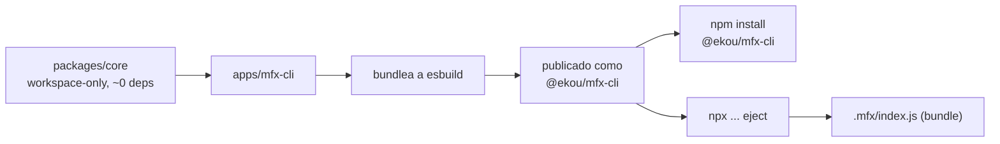

# mfx-cli — Architecture

CLI devtool para gestionar microfrontends bajo la marca EKOU. TUI interactiva
construida con Ink, orquestación de procesos, asignación de puertos, theming
configurable, y dos formas de instalación: como dependencia normal o como
código fuente que el usuario es dueño.

---

## Monorepo

```
ekou-devtools/
├── apps/
│   └── mfx-cli/          ← binario @ekou/mfx-cli
├── packages/
│   ├── core/             ← process manager, config parser, port assignment
│   ├── tui/              ← componentes Ink reutilizables
│   └── types/            ← tipos TypeScript compartidos
└── docs/
    ├── requirements.md   ← especificación funcional (FR-01 a FR-12)
    ├── architecture.md   ← este archivo
    ├── adr/              ← decisiones de arquitectura, formato MADR
    └── assets/
```

Turborepo orquesta build/test entre `apps/` y `packages/`. Solo
`apps/mfx-cli` se publica a npm — `packages/*` son workspace-internal,
nunca se instalan por separado.

---

## Stack

| Área | Elección |
|---|---|
| CLI framework | Commander.js + Ink (React para terminal) |
| Setup wizard | @clack/prompts |
| Tests | Vitest + ink-testing-library + execa |
| Decisiones de arq. | Formato MADR en `docs/adr/` |

---

## Arquitectura — capas



`packages/tui` solo lee del event bus — nunca llama directo a `core`.
Eso es lo que permite testear el orchestrator entero con
`ink-testing-library` sin levantar ninguna TUI real.

---

## El event bus como columna vertebral



El dominio (config/puertos/theme) nunca habla directo con la TUI. Por eso
se puede apagar el panel de notificaciones (FR-10) sin tocar el orchestrator,
o testear el orchestrator sin la TUI.

---

## Qué pasa al iniciar un MFE



---

## Decisión: reapertura del navegador (FR-05)



> **Pendiente:** falta un paso "¿está listo para aceptar conexiones?" antes de
> abrir el navegador. Sin él, la primera vez puede abrirse contra un dev server
> que aún no responde. Opciones: polling al puerto vs. parseo del log de
> Vite/webpack. Ver §Pendientes.

---

## Distribución: npm vs eject



**Opción 1 — como dependencia normal**

```bash
npm install @ekou/mfx-cli
```

**Opción 2 — copy-paste (sin dependencia)**

```bash
npx @ekou/mfx-cli eject
```

`eject` copia `apps/mfx-cli/` + `packages/core/` ya compilados (vía esbuild)
a una carpeta `.mfx/` dentro del proyecto del usuario:

```
tu-proyecto/
└── .mfx/
    ├── index.js          ← bundle compilado, cero deps externas
    └── mfx.config.json
```

Y agrega un script en `package.json`:

```json
{
  "scripts": {
    "mfx": "node .mfx/index.js"
  }
}
```

Sin `node_modules/@ekou`, sin actualizaciones automáticas, sin dependencia
de npm. La separación `core` + `cli` es lo que permite bundlear todo en un
solo `index.js` autocontenido.

---

## Decisiones de diseño clave

- **Result type en vez de excepciones** para errores esperados (config inválida,
  overlap de puertos) → errores siempre claros y accionables.
- **`packages/core` es zero-runtime-deps.** Toda validación de `mfx.config.json`
  es hand-rolled; `zod` vive aislado en un script de generación del JSON Schema
  (`config/schema-gen/`), nunca en el path de ejecución real.
- **`Session`** (en `packages/core`) es la única fuente de verdad de "qué está
  corriendo" y "qué ya se abrió en el navegador" — resuelve FR-05 y FR-08 sin
  que la TUI ni el orchestrator lleven su propio estado paralelo.
- **`assignPorts` es una función pura y determinística** → testeable con
  property-based testing (`fast-check`) en vez de enumerar casos a mano.

---

## Pendientes

Abiertos — no implica que estén fuera de alcance, implica que faltan decidir:

- [ ] Detección de "listo" antes de abrir el navegador (FR-05)
- [ ] Comportamiento ante un MFE que truena solo, sin intervención del usuario
- [ ] Propagación de Ctrl+C a todos los child processes (cierre limpio)
- [ ] Dos instancias de `mfx` corriendo contra el mismo `mfx.config.json`
- [ ] Soporte multiplataforma de purge de puertos (Windows vs. Unix)
- [ ] Modo no-interactivo / CI (`--json`, códigos de salida)
- [ ] Trust boundary explícito: comandos arbitrarios en `mfx.config.json`
- [ ] Versionado y migración del schema de `mfx.config.json`

---

## Ver también

- [requirements.md](requirements.md) — especificación funcional completa (FR-01 a FR-12)
- [adr/](adr/) — decisiones de arquitectura individuales (MADR)
