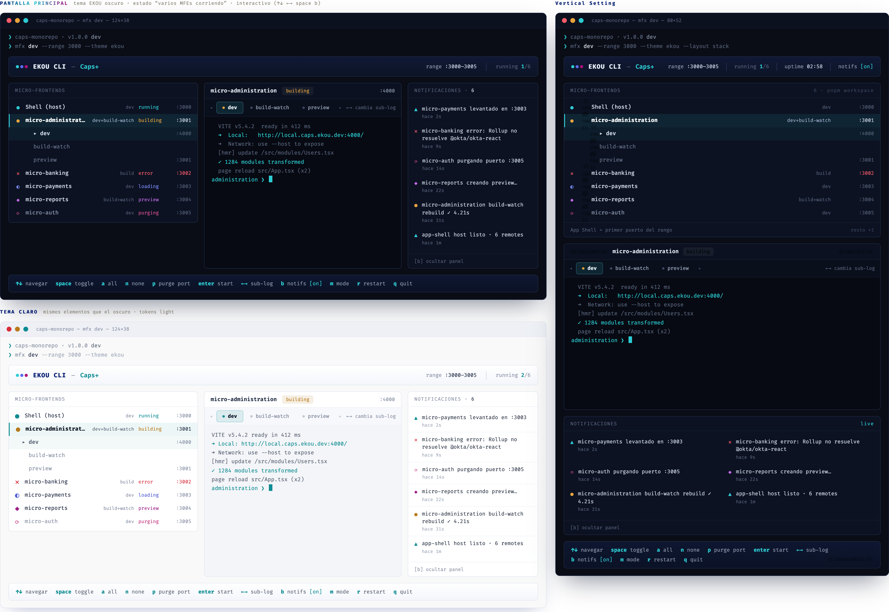

# EKOU DevTools — Requirements · v1

**Product:** `mfx-cli` (npm package) · command `mfx` · EKOU brand.
**v1 scope:** requirements definition. Does not include implementation.

## Conventions
- User stories in Given / When / Then format.
- Functional requirements as `FR-xx`.

## Cross-cutting UX Principles
Apply to ALL requirements; not repeated in each one:
- **Status feedback always visible:** the CLI keeps the user informed of
  what is happening in each MFE (loading, building, creating preview, purging, etc.).
- **Real-time logs:** every operation that starts an MFE streams its log live.
- **Clear errors:** any error is displayed in a readable and actionable way.

## Distribution
- **Given** a dev **when** they need a devtool to manage microfrontends
  **then** they can install it from npm as a library (`mfx-cli`).
- **Given** a user with strict security policies **when** installing `mfx-cli`
  **then** they can install it as source code they own (copy-paste style,
  ready to run), not only as a dependency.

## Configuration
- **Given** a user **when** configuring the CLI **then** they can do so from a
  readable contract file (`mfx.config.json` with `$schema` for validation/autocompletion)
  **or** from an onboarding wizard (`mfx init`) that generates that same file.
  The file is the source of truth; the wizard only produces it.
- Configurable parameters in v1:
  - **App Shell and its port:** defaults to the first port in the effective range.
  - **Project name:** displayed in the header as `EKOU CLI — {projectName}`.
  - **Port range** (see §Port Assignment).
  - **Run commands per mode:** dev, build, build+watch, etc.; with support
    for custom commands per mode.

## Port Assignment
- `ports` omitted → Vite default (5173), sequential +1 per MFE.
- `ports: 5000` (integer) → range start, sequential +1 per MFE.
- `ports: "5000-5060"` (string) → explicit range, inclusive on both ends.
- The App Shell always takes the first port in the effective range.
- Validation with a clear error if: `end < start`, range insufficient for the number
  of MFEs, or port overlap.

## Theming
- **FR-01** The CLI follows the EKOU visual identity; the **EKOU** theme is the default.
- **FR-02** Offers several predefined themes and allows defining a custom theme,
  in the style of Tailwind or MUI theming configuration.

## MFE Management
- **FR-03** Allows selecting which MFE(s) to start.
- **FR-04** Each MFE has a default port (editable) and mode, both individual.
- **FR-05** When starting an MFE, opens the browser at its URL **only the first time**
  that MFE runs in the session; on restarts it does not reopen it.
- **FR-06** Menu option to open a specific MFE or all running ones in the browser;
  if there are multiple, shows a selector.

## Logs
- **FR-07** Displays the live log of the running MFE.
- **FR-08** If an MFE runs in multiple modes simultaneously (e.g. dev + build), displays
  the log for each mode and allows navigating between them with arrow keys to view them individually.

## Persistent Bottom Menu
- **FR-09** Bottom bar always available with the current commands, e.g.:
  `↑↓ navigate` · `space toggle` · `a all` · `n none` · `p purge port {range}` ·
  `enter start` · `q quit`, plus available options depending on context.

## Notifications Panel
- **FR-10** Notifications panel togglable from the bottom menu.
- **FR-11** Displays real-time events (MFE started, MFE purged, error starting, etc.).
- **FR-12** Configurable: the user chooses which notification types to receive.

## UI Mockup

